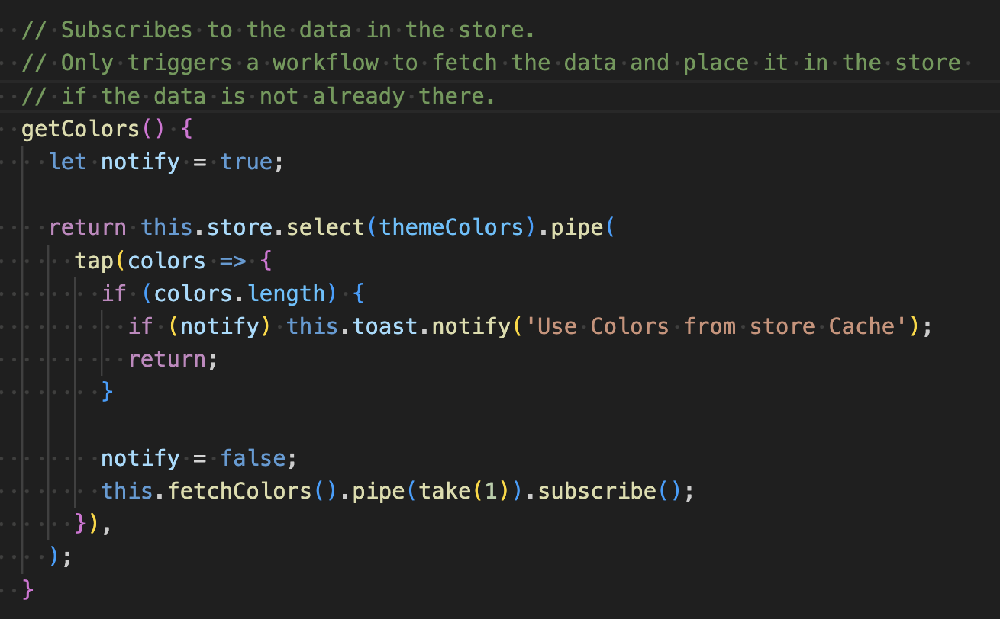
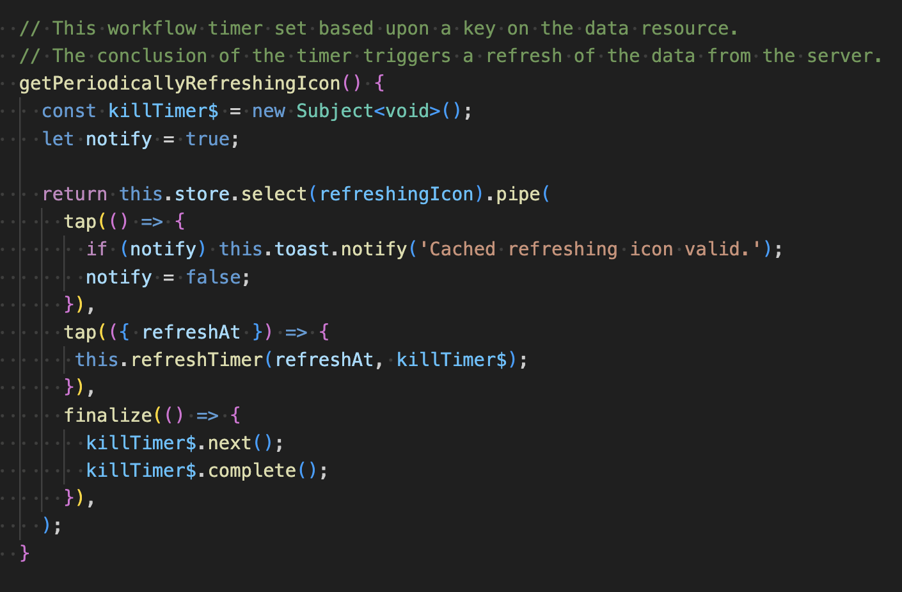
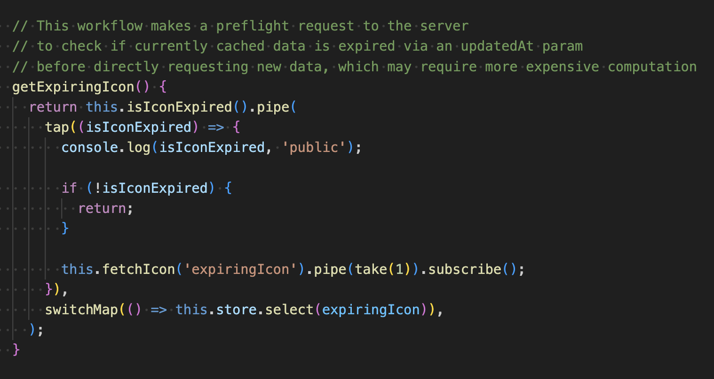

# NgRx Cache Example

#### Live Site: [https://mikeymanoguerra.github.io/ngrx-cache-example/](https://mikeymanoguerra.github.io/ngrx-cache-example/)

This repository demonstrates three different caching schemes for use in Angular with NgRx store, named Session Cache, (Auto) Refreshing Cache, and Expiring Cache.

The crux of the project are the icon.service.ts and color.service.ts . Most of the rest of it serves as boilerplate or beautification.

__Session Cache__: Data fetched from API once, persists in store lasts for life of session.  

__Auto Refreshing Cache__: Observable tracks validity of data via expiration date value, Automatically fetches new data and updates store. 

__Expiring Cache__: Preflight request on creation of new observable, fetches fresh data if store data is expired. 

